# Algoritmos desarrollados en HTML-CSS-JavaScript-Bootstrap

Instituto Profesional de Educación Comunitaria  
:house: IPEC Santo Domingo de Heredia  
Autor: Jesús Alberto Moscoso Agüero  
:v: J. Mosro  
:email: jmosro.14@gmail.com  
2021  
:costa_rica:  

## [**01-Infotec-EstrategiaEvaluacion-Bootstrap/**](01-Infotec-EstrategiaEvaluacion-Bootstrap) :label:  

Ejercicios resueltos en lenguaje HTML y CSS, utilizando el Framework Bootstrap v5.0.2, para trabajo en clase y casa. Desarrollo en GTA - Guías de Trabajo Autónomo del 2021 para primera Estrategía de Evaluación del segundo período. Subárea: Programación, del tercer año. Carrera: Técnico Medio en Informática en Desarrollo de Software. Temática: Diseño de página web para la empresa Infotec, se dedica a la venta de software a la medida para proyectos informáticos.  

`Infotec - Filosofía`  
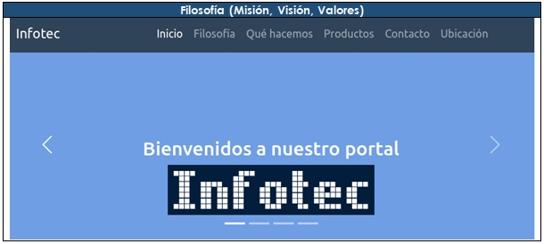  
`Infotec - Qué hacemos`  
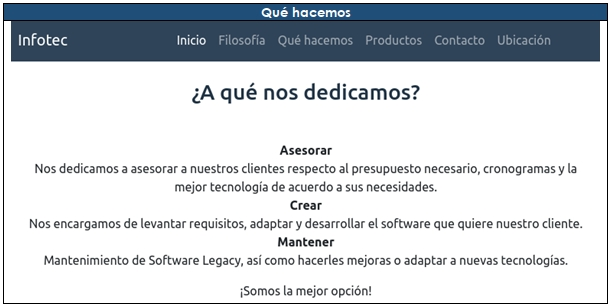  
`Infotec - Productos`  
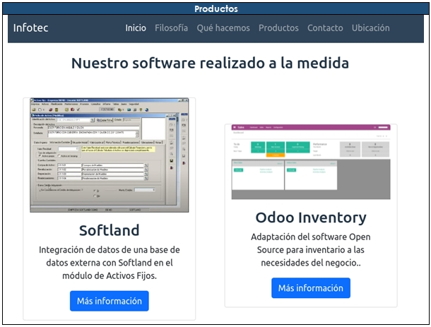  
`Infotec - Contacto`  
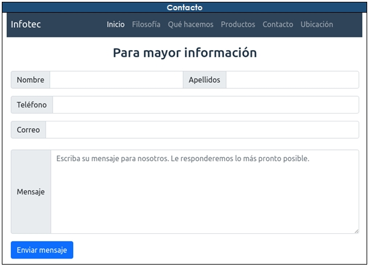  
`Infotec - Footer`  
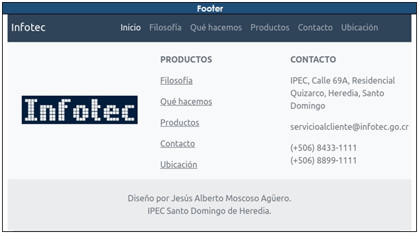  

## [**02-IPEC-Bootstrap/**](02-IPEC-Bootstrap) :label:  

Ejercicios resueltos en lenguaje HTML y CSS, utilizando el Framework Bootstrap v5.0.2, para trabajo en clase y casa. Desarrollo en GTA - Guías de Trabajo Autónomo del 2021. Subárea: Programación, del tercer año. Carrera: Técnico Medio en Informática en Desarrollo de Software. Temática: Diseño de página web para la institución IPEC Santo Domingo de Heredia, para promocionar la carrera técnica de Informática en Desarrollo de Software.  

`IPEC - Noticias y Opiniones`  
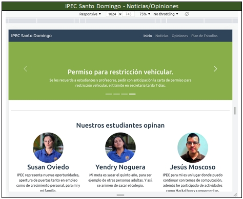  
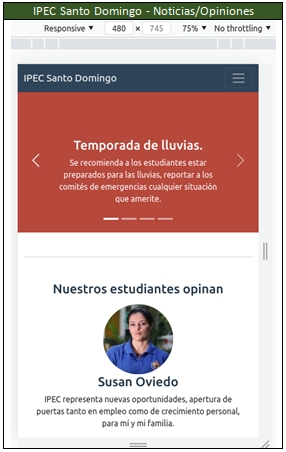  
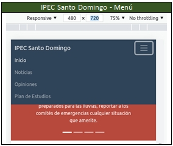  
`IPEC - Plan de Estudios`  
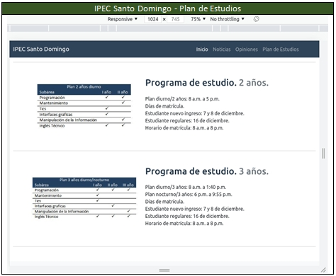  
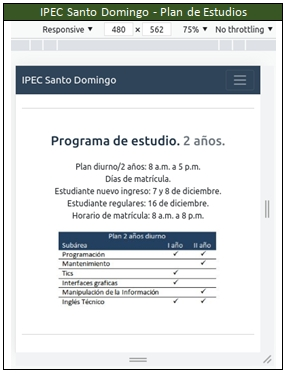  
`IPEC - Footer`  
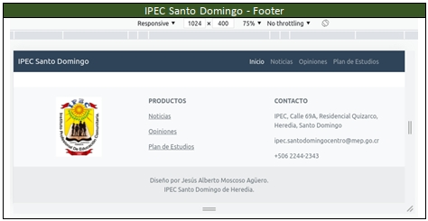  
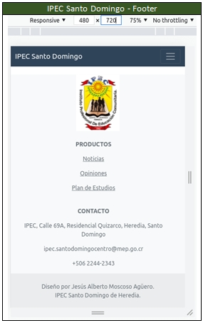  

## [**03-InfoIPEC-HTML-CSS-JavaScript/**](03-InfoIPEC-HTML-CSS-JavaScript) :label:  

Ejercicios resueltos en lenguaje HTML, CSS y JavaScript, para trabajo en clase y casa. Desarrollo en GTA - Guías de Trabajo Autónomo del 2021. Subárea: Programación, del tercer año. Carrera: Técnico Medio en Informática en Desarrollo de Software. Temática: Diseño de página web para la empresa InfoIPEC, se dedica a la venta y reparación de equipo informático.  

`InfoIPEC - Catálogo`  
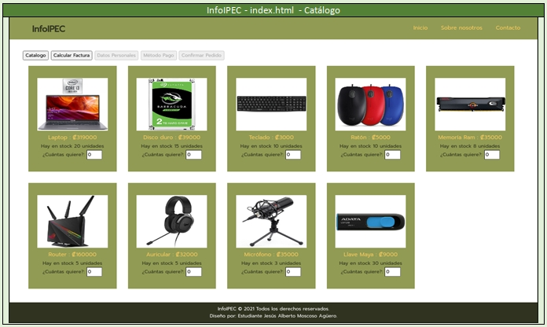  
`InfoIPEC - Calcular Factura`  
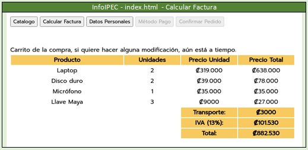  
`InfoIPEC - Datos Personales`  
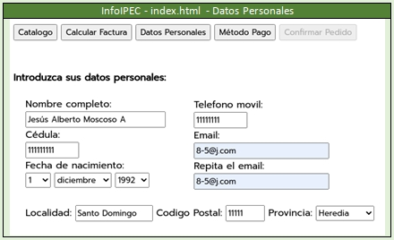  
`InfoIPEC - Método de Pago`  
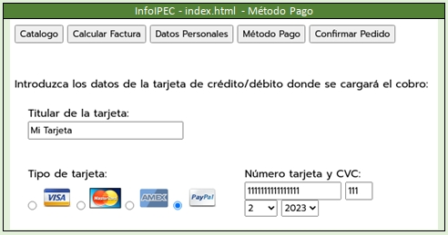  
`InfoIPEC - Confirmar Pedido`  
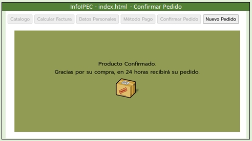  

---
